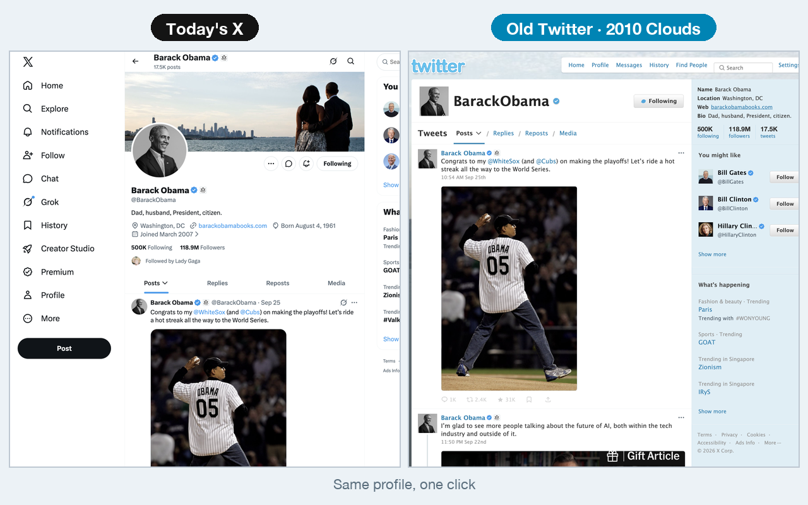
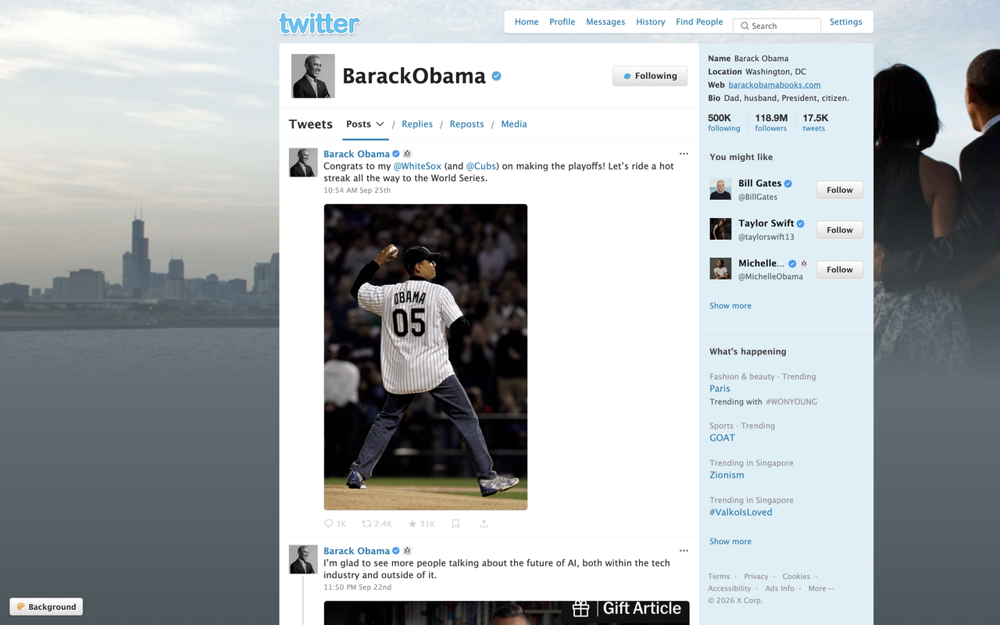
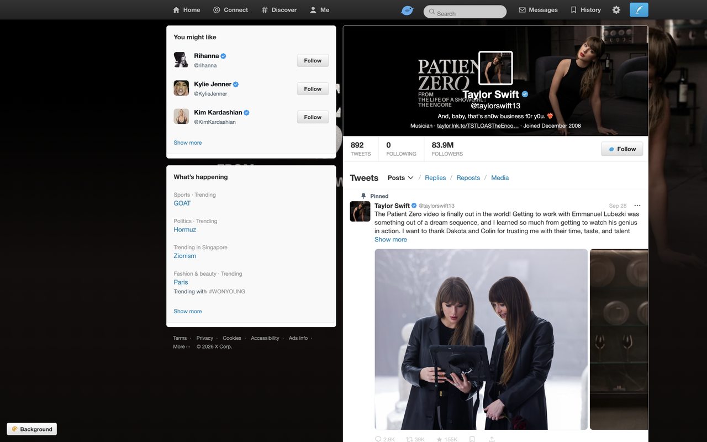
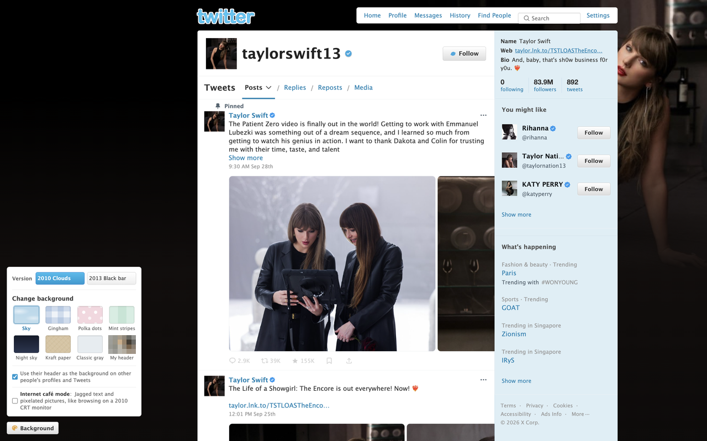

# Old Twitter Skin (unofficial)

A Chrome extension that makes today's x.com look like old Twitter again. Two looks, one click to switch:

- **2010 Clouds**: sky-blue background with clouds, white timeline, light-blue sidebar, "What's happening?" box, and "about 5 hours ago" under every tweet
- **2013 Black bar**: the black top bar with Home / Connect / Discover / Me, a blue bird in the middle, and the big header profile card



By Gabe · [GitHub](https://github.com/gabrielxie55) · [Xiaohongshu](https://www.xiaohongshu.com/user/profile/5e30224d0000000001002b1b) · [中文说明](#古早推特皮肤非官方)

## What it does

- **Two versions**: 2010 Clouds and 2013 Black bar. Switch from the toolbar icon or the "Background" button at the bottom left of the page
- **8 backgrounds**: sky, gingham, polka dots, mint stripes, night sky, kraft paper, classic grey, or your own header
- **Other people's profiles use their own header as the page background**, like the custom profile backgrounds everyone had back then (it falls back to the header's colors when the image would look blurry)
- **Internet café mode**: jagged text, pixelated avatars and faint CRT scanlines
- **Hides what didn't exist back then**: Grok, Premium upsells, promoted posts, view counts and "Who to follow" inserts in the timeline
- **Keeps what people actually use**: bookmarks, share, messages and history stay, restyled to match
- **Turn it off anytime**: for every tab, or just the current tab to compare with today's X
- Works with X in English, Simplified Chinese and Traditional Chinese

| 2010 Clouds | 2013 Black bar |
|---|---|
|  |  |



## Install

Coming to the Chrome Web Store soon. For now, install it in developer mode (takes a minute):

1. Download this project (green **Code** button → **Download ZIP**) and unzip it
2. Open `chrome://extensions` and turn on **Developer mode** (top right)
3. Click **Load unpacked** and choose the `extension` folder inside the unzipped project
4. Open x.com and refresh

Works in desktop Chrome, Edge, Brave and Arc. Mobile browsers don't support extensions

## Privacy

- It only changes how x.com looks, inside your own browser. It does not call Twitter/X APIs and never posts, likes or follows anything for you
- No data is collected or sent anywhere. There is no server and no analytics
- The only permission is `storage`, to remember your version, background and other settings locally. [Privacy policy](PRIVACY.md)

## Disclaimer

Unofficial personal project, not affiliated with X Corp. Twitter is a trademark of X Corp. The bird icon and background patterns are drawn from scratch; no official Twitter assets are used

---

# 古早推特皮肤（非官方）

一个 Chrome 插件，把现在的 x.com 换回古早推特的样子。两个版本一键切换：

- **2010 云朵版**：天蓝底加白云，白色内容区配浅蓝侧栏，「有什么新鲜事？」发推框，推文下面一行「大约 5 小时前」
- **2013 黑条版**：顶部黑色导航栏「主页 / 联系 / 发现 / 我」，个人页大横幅资料卡

作者：盖比Gabe · [小红书](https://www.xiaohongshu.com/user/profile/5e30224d0000000001002b1b) · [GitHub](https://github.com/gabrielxie55)

## 能做什么

- **两个版本**：2010 云朵版、2013 黑条版，在插件面板或页面左下角一键切换，立刻生效
- **换背景**：天空、蓝格子、粉圆点、薄荷条纹、夜空、牛皮纸、经典灰、我的横幅，8 种背景全是代码画的
- **别人的主页用他自己的横幅当背景**：像当年人人都能换整页背景那样，每个人的主页都不一样；横幅太小会糊时自动改成只取颜色
- **网吧模式**：锯齿字、像素头像、淡淡的显示器扫描线，像 2010 年在网吧大头显示器上刷推
- **界面文字跟着推特的语言走**：中文界面用 2011～2013 年推特官方中文版的叫法，英文、繁体中文也有
- **藏掉当年没有的东西**：Grok、会员推销、广告推文、浏览量、时间线里插的推荐关注
- **用户真正会用的功能都留着**：书签、分享、私信、历史，只把样子统一成古早风格
- **随时开关**：点工具栏的小鸟图标，可以全部关掉，也可以只关当前标签页，方便跟原版对比

## 隐私

- 只改页面的样子：插件在你自己的浏览器里给 x.com 换样式、调整页面元素，不调用推特的接口
- 不读取、不收集、不上传任何数据，没有服务器
- 只申请了一个权限 `storage`，用来记住你选的版本、背景这些设置，存在你自己的浏览器里

## 安装

Chrome 应用商店上架中。现在可以先用开发者模式安装：

1. 下载这个项目（右上角 Code → Download ZIP），解压
2. Chrome 地址栏打开 `chrome://extensions`，打开右上角的「开发者模式」
3. 点「加载未打包的扩展程序」，选解压出来的 `extension` 文件夹
4. 打开 x.com，刷新一下

电脑上的 Chrome、Edge、Brave、Arc 都能用；手机浏览器不支持插件

## 项目结构

```
extension/
  manifest.json    插件清单
  content.js       主脚本：顶栏、资料卡、侧栏、版本切换、换背景、网吧模式等
  styles.css       2013 黑条版样式（也是两个版本共用的基础样式）
  era2010.css      2010 云朵版样式，在 2013 版基础上覆盖
  popup.html/js    点小鸟图标弹出的面板
  background.js    后台：图标上的 OFF 标记、开发模式自动刷新
  dev-reload.js    开发模式自动刷新（从应用商店装的版本不会运行）
  icons/           插件图标（自己画的小鸟）
设计规范-2013版.md   从 2013 年推特页面实测的颜色、字号、尺寸
安装和测试说明.md    开发时的安装和调试说明
```

## 声明

这是一个非官方的个人项目，与 X Corp. 没有任何关系。Twitter、推特是 X Corp. 的商标。插件里的小鸟图标、背景图案都是自己画的，没有使用推特的官方素材
